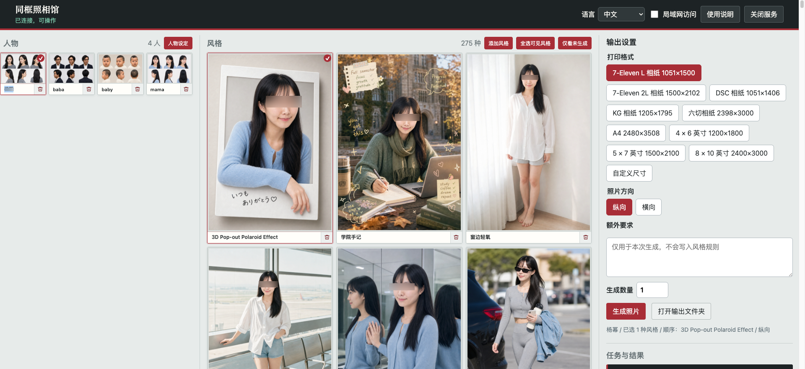

# [myerwang/PhotoClub](https://github.com/myerwang/PhotoClub)

# PhotoClub



PhotoClub is a local AI photo studio console for building reusable character references, applying photo styles, and generating print-ready images from Codex Desktop.

## 中文

PhotoClub 是一个本地 AI 照相馆控制台。它把“人物设定”和“照片生成”拆成两个阶段：先为每个人生成稳定的人物多视图参考图，再把这些参考图和所选风格一起交给图像生成任务，用来减少人物五官漂移，并支持多人物同框照片。

### 功能

- 人物设定：从 `input/人物名/` 的多张参考照片生成一张胸像多视图，也可以用文字描述生成真实或虚构人物设定。
- 多人物生成：人物可多选，生成时会把所有选中人物放进同一张照片。
- 风格系统：`styles/*.md` 是独立可追加的风格文件，支持在控制台中添加、删除和选择多个风格。
- 批量生成：选择多个风格时按顺序执行；生成数量会应用到每个风格。
- 打印格式：内置 7-Eleven L、2L、DSC、KG、A4、4x6、5x7、8x10 等常见尺寸，也支持自定义像素尺寸和横向/纵向。
- 贴纸风格：支持贴纸岛布局、出血安全边距和 7-Eleven 1L 输出。
- 生成历史：永久记录批次进度；额度不足、取消或中断后可继续未完成部分，已完成输出不会重复生成。
- 本地隐私：输入、人物设定、输出照片和风格预览默认不提交到 Git。
- 三语界面：控制台支持中文、日本語、English 实时切换。

### 启动

唯一前提是已经安装并登录 Codex 桌面版。无需预装 Node.js、npm、pnpm、Python、图片工具、系统包管理器或 API Key。

在 Codex 桌面版中打开本项目并输入：

```text
启动 PhotoClub
```

启动 Skill 会使用 Codex 内置运行时检测环境、自动安装项目本地依赖、启动服务、完成健康检查，并通过系统默认浏览器打开控制台。

## 日本語

PhotoClub はローカルで動作する AI 写真館コンソールです。人物設定と写真生成を分けて扱います。まず人物ごとに安定した多視点参照画像を作成し、その参照画像と選択したスタイルを使って最終写真を生成することで、顔の一貫性を保ちやすくします。複数人物の同時生成にも対応します。

### 主な機能

- 人物設定：`input/人物名/` 内の複数写真から胸上の多視点参照画像を 1 枚生成できます。テキスト説明から実在人物または架空人物の設定を作ることもできます。
- 複数人物生成：人物を複数選択し、同じ写真内に配置できます。
- スタイル管理：`styles/*.md` は独立したスタイルファイルです。コンソールから追加、削除、複数選択できます。
- 一括生成：複数スタイルを選ぶと選択順に実行され、生成枚数は各スタイルに適用されます。
- プリント形式：7-Eleven L、2L、DSC、KG、A4、4x6、5x7、8x10 などのサイズと、カスタムピクセルサイズ、縦横方向をサポートします。
- ステッカースタイル：ステッカー島レイアウト、塗り足し安全余白、7-Eleven 1L 出力に対応します。
- 生成履歴：バッチ進捗を保存します。上限到達、キャンセル、中断後も未完了分だけ続行でき、完了済み画像は再生成しません。
- ローカルプライバシー：入力画像、人物設定、出力画像、スタイルプレビューは標準では Git に保存されません。
- 多言語 UI：中国語、日本語、英語をリアルタイムに切り替えできます。

### 起動

必要なのは Codex デスクトップ版のインストールとログインだけです。Node.js、npm、pnpm、Python、画像ツール、システムパッケージマネージャー、API Key は不要です。

Codex デスクトップ版でこのプロジェクトを開き、次のように入力します。

```text
启动 PhotoClub
```

起動 Skill が Codex 内蔵ランタイムで環境を確認し、ローカル依存関係を自動インストールし、サービス起動、ヘルスチェック、既定ブラウザでのコンソール表示まで行います。

## English

PhotoClub is a local AI photo studio console. It separates character profiling from final photo generation: first create a stable multiview reference image for each person, then use those references with selected styles to generate final photos. This helps reduce facial drift and supports multi-person same-frame images.

### Features

- Character profiles: generate one chest-up multiview reference from multiple photos in `input/name/`, or create a real or fictional character from a text description.
- Multi-person photos: select more than one person and generate them together in one image.
- Style system: each `styles/*.md` file is a standalone style plugin. Styles can be added, deleted, and multi-selected from the console.
- Batch generation: selected styles run in order, and quantity applies to each selected style.
- Print formats: built-in 7-Eleven L, 2L, DSC, KG, A4, 4x6, 5x7, 8x10, plus custom pixel sizes and portrait/landscape output.
- Sticker workflow: supports sticker-island layouts, bleed-safe margins, and 7-Eleven 1L output.
- Generation history: batch progress is persisted. After quota limits, cancellation, or interruption, PhotoClub resumes only unfinished outputs and does not regenerate completed images.
- Local privacy: input images, profiles, output photos, and style previews are excluded from Git by default.
- Trilingual UI: switch between Chinese, Japanese, and English in real time.

### Start

The only prerequisite is Codex Desktop installed and signed in. You do not need to preinstall Node.js, npm, pnpm, Python, image tools, system package managers, or an API key.

Open this project in Codex Desktop and enter:

```text
启动 PhotoClub
```

The startup Skill uses the bundled Codex runtime to check the environment, install project-local dependencies when needed, start the local service, run a health check, and open the console in your default browser.

## Private Local Directories

- `input/`: user reference photos
- `profiles/`: character multiview references
- `output/`: generated results

The directories stay in the repository, but real photos and generated files inside them are ignored.

Style previews are generated locally at `styles/previews/<styleId>.jpg` after successful generation. Each style keeps only its latest local preview, and preview images are not committed to Git.
